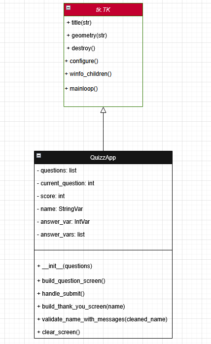
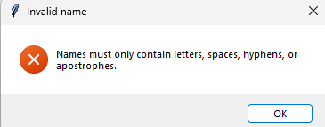
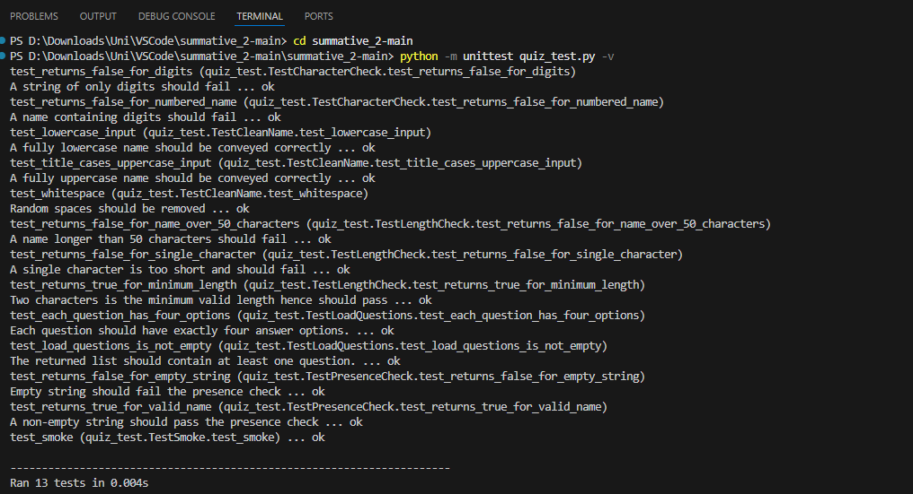

# Hitachi Rail Safety Quiz 🚄

## Introduction
As a business operating on *critical national infrastructure*, safety is at the forefront of our principles. Hence, I have designed and developed a brief safety related quiz that serves as a **MVP**, and would hopefully help in increasing awareness of safety practices and knowledge overall within the organisation. Essentially, it's been created with the mindset that anyone should be able to go through it, whether that be using it as a tool for induction of new employees, or perhaps as a refresher for existing staff, or perhaps even just as a baseline resource for managers to review their team. Currently, there is no standardised way to check whether staff have a working knowledge of key safety topics - this application exists to bridge that gap.

Built using [Python](https://docs.python.org/3/) for the backbone and [Tkinter](https://docs.python.org/3/library/tkinter.html) for the GUI, my app works initially by prompting participants to enter their name, followed by asking 5 multiple choice questions on topics such as PPE, fire procedures and UK legislation.

One of the cool things about the app is the validation rules/checks. If something goes against the rules *(e.g. entering numerical values in name box)* and the user attempts to submit, an [error](docs_assets/error_message.png) message will pop up - the user is unable to proceed until this is fixed. Once a submission is made, the name, answers, and a timestamp all get written to a [CSV file](https://docs.python.org/3/library/csv.html) that can be viewed conveniently, using standard software like [MS Excel](https://www.microsoft.com/en-gb/microsoft-365/excel), making the process of analysing the data quite easy and accessible!

Naturally as a MVP, comprehensive features are out of scope; this app only presents the bare minimum to users at its current stage, allowing for plenty of room for improvement in the future😊

Let's move on to the <ins>**exciting**</ins> bits now⬇️

## Design

### GUI Design

**Figure 1:** Wireframe

Through **Figure 1** we can see the very early wireframe during the design stage of my application, prior to any code being written. Using the design platform [Figma](https://www.figma.com/), I was able to build and visualise an idea of how I wanted the user journey to look like, both successful and unsuccessful (error message). Frame 2 (bottom left) shows the app in an error state which would activate if the user goes against any validation rules, whereas Frame 3 (bottom right) conveys a successful submission, exemplified by the green font! Visually, you'll notice it's quite a far fetch from the final application, but the wireframe was not used to focus on visual presentation, rather just the journey of a user and screen layouts. Laying these foundations is much more important than emphasising presentation. Although, one visual aspect I did want to identify at this stage was the focus on using the brand colour scheme so users would know that this is an official communication. As we see in **Figure 1**, I used a red background to highlight the primary colour of the company. Once it came to actually coding the GUI however, I realised that this was simply too much red and wasn't very pleasing to the eye after a few minutes, so red was turned into an accent colour instead, still reflecting the brand identity.

[View Figma Wireframe](https://www.figma.com/design/RHAnN1kOKP6Ibnj0Q6p2F0/Hitachi-Rail-Quiz-Design?node-id=0-1&t=OpVAHXUjfVeYXzuA-1)

### Functional & Non-Functional Requirements

#### Functional Requirements
The following table conveys my functional requirements. These are requirements that shape the basis of the program - if any of these are not met, then the application has not been created successfully.

| ID  | Requirement |
|-----|-------------|
| FR1 | The application must write the name, answers and timestamp to a CSV file. |
| FR2 | The application must validate the name before submission. |
| FR3 | The application must allow a user to enter a name. |
| FR4 | The application must display a confirmation screen after a successful submission. |
| FR5 | The application must display 5 Multiple Choice Questions. |

#### Non-Functional Requirements
The following table conveys my non-functional requirements. These are elements that aren't integral to the running of the program, but provide a level of accessibility and convenience - if any of these are not met, then there is room for improvement within the application.

| ID  | Requirement |
|-----|-------------|
| NFR1 | The application should follow Hitachi branding. |
| NFR2 | The application should be easy on the eyes when viewing for a long period. |
| NFR3 | The application should convey why an error has occured within the message. |
| NFR4 | The application should implement accessibilty features e.g. speech reader. |
| NFR5 | Stored data should be readable using standard software e.g. MS Excel. |

### Tech Stack
- [Python 3](https://docs.python.org/3/) — core programming language
- [Tkinter](https://docs.python.org/3/library/tkinter.html) — desktop graphical user interface
- [csv](https://docs.python.org/3/library/csv.html) — local data storage in CSV format
- [re](https://docs.python.org/3/library/re.html) — regular expressions for input validation, ensures that the name does not contain any numerical values
- [datetime](https://docs.python.org/3/library/datetime.html) — timestamp generation to then use for csv log
- [unittest](https://docs.python.org/3/library/unittest.html) — automated unit testing for testing parts of the app before it's fully complete

### Code Design


**Figure 2:** Class Diagram

**Figure 2** illustrates the class diagram design that formed the structure of my app. QuizzApp is the child class, inheriting from tk.Tk which is the parent class from Tkinter already built in. The benefit of this is QuizzApp is able to get its functionality through the inheritance rather than having to rewrite it, such as mainloop() for example which keeps the window open, and destroy() which closes it. The hollow triangle pointing to the parent class is how we can interpret from the diagram that this is an inheritance relationship. You will also notice that QuizzApp lists its own attributes to keep track of state, such as the list of questions and participant names, along with the 6 methods that handle everything from building the quiz screen to validating the name and saving results. These are methods we brought in ourself as Tkinter does not provide these functions - essentailly, tk.Tk gives us a blank canvas(window) and we build everything on top of that.

## Development
To lay the basics, my code is split across 3 main .py files - main.py, quiz_data.py and quiz_utils.py (quiz_test.py is only for testing purposes). This was a deliberate approach to ensure code hygiene through separation of aspects - the GUI, question loading and input validation are all essential to running the program but serve independent of one another, which I came to realise made the code easier to maintain and test. For example, I faced a hiccup where the app was failing to load the questions. Immediately, I knew I could pin this down primarily towards a problem within the quiz_data.py file which is responsible for that data, allowing me to fix my code at an efficient pace and reupload only that updated file onto my github repo rather than the entire folder.

### Modular Design / Pure Functions
quiz_utils.py is where my validation functions sit, all written as pure functions, meaning they take an input and return an output without touching anything else e.g.GUI. This was an important feature I wanted to implement for this project due to the benefits it provides; pure functions are predictable and straightforward, which makes them easy to unit test (will be covered in Testing section). Below is an example of one of my many pure functions - this specific one is for length checks:

```python
def presence_check(name: str) -> bool:
    
    """
    Checks that a name has been provided.
    Also a pure function. Returns True if the name is not empty.
    """
    return bool(name)
```
Notice that a docstring has been inserted to provide a short description of the function and label whether or not it is pure - making this distinguish between pure/impure functions was a conscious decision that allows myself and others viewing the code to understand it better.

Let's take a look at an improper function:

```python
def load_questions(filepath=None):

    """
    Load questions from a CSV file and return a list of question dictionaries.
    The output depends on external state (the contents of questions.csv) — not pure.
    If the file changes, the function returns different results for the same input.
    """
```
Since the output of load_questions is reliant on a separate input (questions.csv, as noted in docstring), this function is impure.

### Object Oriented Programming/Design
```python
class QuizzApp(tk.Tk):
```
The application is built as a class, QuizzApp, which inherits from tk.Tk (refer to **Figure 2**), meaning rather than managing the GUI window and the application logic separtely, QuizzApp itself is also the window, allowing it to encapsulate all states and behaviours in a single place. All the important information the app needs to keep track of such as the participant name and selected answers, are stored as attributes on the class. This is what then allows handle_submit to access the answers that were selected when build_question_screen ran.

### Validation
You'll notice that validation has been split into two layers - the pure functions in quiz_utils.py do the actual checking, whilst validate_name_with_messages in main.py handles the user-facing side such as error pop-ups (see Figure 3 below) and deciding whether to block the submission attempt. Hence, we can test the logic of the application independently of the GUI.



**Figure 3:** Error Message

### Data Storage
As my first functional requirement, responses should be saved to a CSV file. My application saves participant names, answers, and timestamps as a response into user_records.csv. This is done in append mode, to make sure that each submission does not overwrite the previous, but rather adds a new row, so we can save each user submission. The reason I've gone with CSV over a database is because it requires minimal setup and works well in the context of a MVP. CSV is also compatible with Excel, so anyone can open it directly via Excel. If we were to expand the application, a database would probably be a more suitable method of data storage.

## Testing



## Documentation

### User

### Technical


## Evaluation
