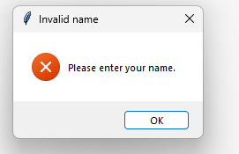
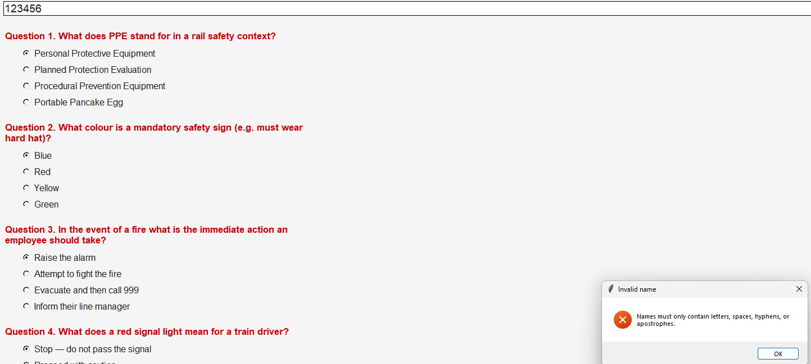
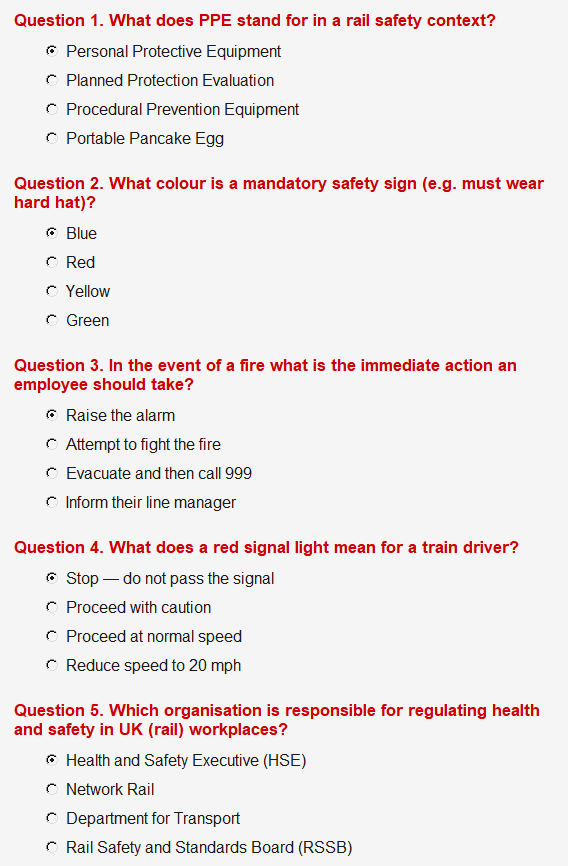
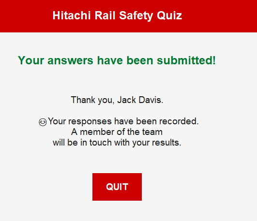

# Hitachi Rail Safety Quiz 🚄

## Table of Contents
[Introduction](#introduction)

[Design](#design)

[Development](#development)

[Testing](#testing)

[Documentation](#documentation)

[Evaluation](#evaluation)

## Introduction
Operating on *critical national infrastructure*, safety is an integral principle. Hence, I've developed a brief safety quiz, serving as a **MVP**, hopefully assisting in increasing awareness of safety practices within the organisation. Essentially, it's been created with the mindset that anyone should be able to go through it, whether that be using it as a tool for induction of new employees or perhaps even just as a baseline resource for managers to review their team. Currently, there is no standardised way to check whether staff have a working knowledge of key safety topics - this application bridges that gap.

Built using [Python](https://docs.python.org/3/) for the backbone and [Tkinter](https://docs.python.org/3/library/tkinter.html) for the GUI, my app works initially by prompting participants to enter their name, followed by asking 5 multiple choice questions on topics such as PPE, fire procedures and UK legislation.

One of the cool things about the app is the validation rules/checks. If something goes against the rules *(e.g. entering numerical values in name box)* and the user attempts to submit, an [error](docs_assets/error_message.png) message will pop up - the user is unable to proceed until this is fixed. Once a submission is made, the name, answers, and a timestamp all get written to a [CSV file](https://docs.python.org/3/library/csv.html) that can be viewed conveniently, using standard software like [MS Excel](https://www.microsoft.com/en-gb/microsoft-365/excel), making the process of analysing the data quite easy and accessible!

Naturally as a MVP, comprehensive features are out of scope; this app only presents the bare minimum to users at its current stage, allowing for improvement in the future😊

Moving on to the <ins>**exciting**</ins> bits now⬇️

## Design

### GUI Design

**Figure 1:** Wireframe

Through **Figure 1** we can see the wireframe during the design stage of my application, prior to any code being written. Using the design platform [Figma](https://www.figma.com/), I was able to build and visualise an idea of how I wanted the user journey to look like, successful and unsuccessful (error message). Frame 2 shows the app in an error state, activated if the user goes against any validation rules, whereas Frame 3 conveys successful submission, exemplified by the green font! Visually, you'll notice it's quite a far fetch from the final application. The purpose of the wireframe was to show the journey of a user and screen layouts. Laying these foundations is much more important than emphasising presentation. Although, one visual aspect I did want to identify at this stage was the focus on using the brand colour scheme so users would know that this is an official communication. As we see in **Figure 1**, I used a red background to highlight the primary colour of the company.

[View Figma Wireframe](https://www.figma.com/design/RHAnN1kOKP6Ibnj0Q6p2F0/Hitachi-Rail-Quiz-Design?node-id=0-1&t=OpVAHXUjfVeYXzuA-1)

### Functional & Non-Functional Requirements

#### Functional Requirements
The following table conveys my functional requirements. These are requirements that shape the basis of the program - if any of these are not met, then the application has not been created successfully.

| ID  | Requirement |
|-----|-------------|
| FR1 | The application must write the name, answers and timestamp to a CSV file. |
| FR2 | The application must validate the name before submission. |
| FR3 | The application must allow a user to enter a name. |
| FR4 | The application must display a confirmation screen after a successful submission. |
| FR5 | The application must display 5 Multiple Choice Questions. |

#### Non-Functional Requirements
The following table conveys my non-functional requirements. These are elements that aren't integral to the running of the program, but provide a level of accessibility and convenience - if any of these are not met, then there is room for improvement within the application.

| ID  | Requirement |
|-----|-------------|
| NFR1 | The application should follow Hitachi branding. |
| NFR2 | The application should be easy on the eyes when viewing for a long period. |
| NFR3 | The application should convey why an error has occured within the message. |
| NFR4 | The application should implement accessibilty features e.g. speech reader. |
| NFR5 | Stored data should be readable using standard software e.g. MS Excel. |

### Tech Stack
- [Python 3](https://docs.python.org/3/) — core programming language
- [Tkinter](https://docs.python.org/3/library/tkinter.html) — desktop graphical user interface
- [csv](https://docs.python.org/3/library/csv.html) — local data storage in CSV format
- [re](https://docs.python.org/3/library/re.html) — regular expressions for input validation, ensures that the name does not contain any numerical values
- [datetime](https://docs.python.org/3/library/datetime.html) — timestamp generation to then use for csv log
- [unittest](https://docs.python.org/3/library/unittest.html) — automated unit testing for testing parts of the app before it's fully complete

### Code Design


**Figure 2:** Class Diagram

**Figure 2** illustrates the class diagram design that formed the structure of my app. QuizzApp is the child class, inheriting from tk.Tk which is the parent class from Tkinter already built in. The benefit of this is QuizzApp is able to get its functionality through the inheritance rather than having to rewrite it, such as mainloop() for example which keeps the window open, and destroy() which closes it. The hollow triangle pointing to the parent class is how we can interpret from the diagram that this is an inheritance relationship. You will also notice that QuizzApp lists its own attributes to keep track of state, such as the list of questions and participant names, along with the 6 methods that handle everything from building the quiz screen to validating the name and saving results. These are methods we brought in ourself as Tkinter does not provide these functions - essentailly, tk.Tk gives us a blank canvas(window) and we build everything on top of that.

## Development
My code is split across 3 main .py files - main.py, quiz_data.py and quiz_utils.py (quiz_test.py for testing purposes). This was a deliberate approach to ensure code hygiene through separation of aspects - the GUI, question loading and input validation are all essential to running the program but serve independent of one another, which I came to realise made the code easier to maintain and test. For example, I faced a hiccup where the app was failing to load the questions. Immediately, I knew I could pin this down primarily towards a problem within the quiz_data.py file which is responsible for that data, allowing me to fix my code at an efficient pace and reupload only that updated file onto my github repo rather than the entire folder.

### Modular Design / Pure Functions
```quiz_utils.py``` is where my validation functions sit, all written as pure functions, meaning they take an input and return an output without touching anything else e.g.GUI. This was an important feature I wanted to implement for this project due to the benefits it provides; pure functions are predictable and straightforward, which makes them easy to unit test (will be covered in Testing section). Below is an example of one of my many pure functions - this specific one is for length checks:

```python
def presence_check(name: str) -> bool:
    
    """
    Checks that a name has been provided.
    Also a pure function. Returns True if the name is not empty.
    """
    return bool(name)
```
Notice that a docstring has been inserted to provide a short description of the function and label whether or not it is pure - making this distinguish between pure/impure functions was a conscious decision that allows myself and others viewing the code to understand it better.

Let's take a look at an improper function:

```python
def load_questions(filepath=None):

    """
    Load questions from a CSV file and return a list of question dictionaries.
    The output depends on external state (the contents of questions.csv) — not pure.
    If the file changes, the function returns different results for the same input.
    """
```
Since the output of load_questions is reliant on a separate input (questions.csv, as noted in docstring), this function is impure.

### Object Oriented Programming/Design
```python
class QuizzApp(tk.Tk):
```
The application is built as a class, QuizzApp, which inherits from tk.Tk (refer to **Figure 2**), meaning rather than managing the GUI window and the application logic separtely, QuizzApp itself is also the window, allowing it to encapsulate all states and behaviours in a single place. All the important information the app needs to keep track of such as the participant name and selected answers, are stored as attributes on the class. This is what then allows handle_submit to access the answers that were selected when build_question_screen ran.

### Validation
You'll notice that validation has been split into two layers - the pure functions in quiz_utils.py do the actual checking, whilst validate_name_with_messages in main.py handles the user-facing side such as error pop-ups (see Figure 3 below) and deciding whether to block the submission attempt. Hence, we can test the logic of the application independently of the GUI.


**Figure 3:** Error Message

### Data Storage
As my first functional requirement, responses should be saved to a CSV file. My application saves participant names, answers, and timestamps as a response into user_records.csv. This is done in append mode, to make sure that each submission does not overwrite the previous, but rather adds a new row, so we can save each user submission. The reason I've gone with CSV over a database is because it requires minimal setup and works well in the context of a MVP. CSV is also compatible with Excel, so anyone can open it directly via Excel. If we were to expand the application, a database would probably be a more suitable method of data storage.

## Testing
For testing, I've incorporated both manual testing and automated unit testing, which we will go through in this section. 

Manual testing consisted of putting myself in the shoes of the user and going through the app myself, checking that each part of the journey the user takes functions as intended e.g. input validation on name entry. This was also stressed in my early Figma prototype as a feature (see Figure 1).

Automated unit testing was done using [unittest](https://docs.python.org/3/library/unittest.html), a python framework which allowed me to test the validation functions in quiz_utils.py in isolation. These functions were written purposely to be pure because I knew it would make it more straightforward to test and hence increase efficiency and ensuring reliable and predictable results.

The benefit of using both these methods of testing was that I could test the logic of the app automatically whilst being able to check the user experience manually, which is actually important to consider as an autoamted test may not always pick up on something that a human may find inconvenient or incorrect.

Below, we can see a showcase of my testing:

### Manual
| ID  | Test | Pass/Fail | Evidence |
|-----|-------------|-----|---------|
| T1 | Submit with empty name field | Pass |  displays correct error |
| T2 | Enter 123456 in name field and submit | Pass |  displays correct error |
| T3 | Ensure all questions are visible on screen | Pass |  all questions on screen |
| T4 | Ensure app closes when clicking quit button | Pass |  The app closes after clicking the QUIT button |
| T5 | Enter valid name and answers and submit to see if app works as intended | Pass |  Valid name was entered and answers submitted, led to success screen |

### Automated


**Figure 4:** Unittest

As seen above, all tests have passed.


## Documentation

### User
This guide is intended for users and explains how to use and navigate the quiz. Thankfully, little technical knowledge is required so it is accessible to most :)

#### Some prerequisites...
Before we can use the app, please make sure that your machine has [Python 3](https://docs.python.org/3/) installed (ensure it is Python **3**). If it isn't installed, you can download it through the [website](https://docs.python.org/3/) or ask the IT Department. Besides from this, all other files will be provided over email (or they can be taken from this repo).

#### Getting Started
Now that Python is installed and you have the quiz files, make sure that they're all saved together in the same folder. Open the terminal and navigate to this folder, then run:

```python main.py```

This will open the quiz window. Great job so far, that deals with the hard bit!

#### The Quiz
1. Enter your full name in the text box at the top of the screen
2. You will be presented with 5 MCQ's, read through them and select one answer each using the radio buttons
3. Click the bright red submit button once you're done!
4. Your response has been recorded, you may press the QUIT button to exit the application.

#### *Running into some issues?*
If you are being presented with error messages on submission attempt, please read through it as it should help you figure out what's wrong. Usually, it will be related to the name input field, please make sure you haven't left it blank or added special characters accidentally. Rectifying this and pressing submit again should solve your problem :)

### Technical
This guide is intended for developers who would like to understand the code, make changes to it, or run tests locally.

#### Code Overview

| File  | Purpose |
|-----|-------------|
| main.py | GUI, Application logic, recording & writing to CSV |
| quiz_data.py | Loading questions from CSV |
| quiz_utils.py | Validation (pure functions) |
| quiz_test.py | Automated unittest |

| File  | Purpose |
|-----|-------------|
| questions.csv | stores questions and answer options |
| user_records.csv | stores participant names, timestamps, and submitted answers |

Ensure [Python 3](https://docs.python.org/3/) is installed. **No external libraries are required** - all libraries used (tkinter, csv, re, datetime, unittest, os) are part of the Python standard library. 

All questions are derived from questions.csv , which can be edited to add/remove/adjust questions and answers, be sure to follow the same format written on line 1 otherwise the code will break.

#### Running Tests
quiz_test.py contains pure testing functions, increasing modularity. All unit tests are in quiz_test.py . To run these tests locally, open the terminal and navigate to the project folder using ```cd``` and run:

```python -m unittest quiz_test.py -v```

Adding the ```-v``` flag will allow you to view individual tests, to see which ones are specifically being tested and passing/failing.

#### Submitted Records
All successful submissions are saved to user_records.csv . If this csv does not exist and a submission is made, it will be generated automatically. Additonally, this csv uses append mode, so a new submission will not overwrite any previous data, but rather be added as a separate entry, allowing us to keep a record of the data. Within the square brackets, a 0 indicates that the participant entered the incorrect answer, whereas a 1 indicates the correct answer. Another benefit of both this and the questions.csv file is they can be opened with other standard software e.g. Excel, which actually helps to meet my fifth non-functional requirement.


## Evaluation

I'm pleased with how my app turned out, especially since I was able to incorporate the course content into one project. Having a design stage before producing the actual application is genuinely useful for how the app should look/function so that's definitely something that worked well with this project - Figma is an incredibly useful tool for this.

The app meets all of my functional requirements, everything works as intended e.g.the input validation is able to catch invalid inputs correctly and block submission attempts. The CSV is also in a reliable state, recording the intended information which can then be accessed using standard software. As an improvement, I think it would be a good idea to add score calculation within the app, definitely something that would be possible with the MCQ format. At present, responses have to be reviewed manually through the CSV, but it would be much more efficient if the app could automatically compare selected answers against the correct answers in the CSV and produce a score that way. This would save time for staff and make the tool more useful.

Indentation caused a few headaches. Often, my code would fail for no reason...only to realise it was an indentation issue - something to be mindful of!

The GUI design colours in the prototype stage felt off, the red background was a distraction after a few minutes, so I changed this when making the GUI. The current design is much better, it still follows brand colours and creates a better viewing experience. Noticeably, the brand logo is absent in the final app - something I could add as an improvement, I could see the benefit in that it would assist in identifying this app as an official resource. Certainly room for development with the GUI - the current design is functional and relates to the brand but could use some polish e.g.a progress bar to improve user experience. Perhaps a picture of a train in the background would also be a neat addition😊.
